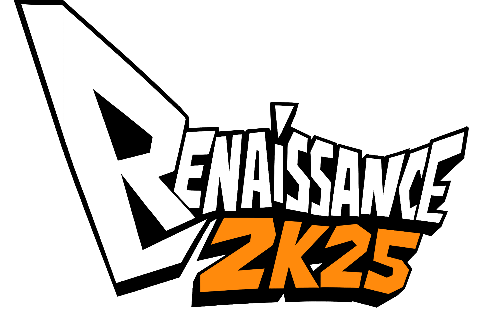

# Renaissance 2K25

---

## Overview
Renaissance 2K25 is the flagship annual technical symposium organized by the Computer Science and Engineering Association (CSEA) at Kongu Engineering College. It brings together students and technology enthusiasts for a day of learning, innovation, and competition.

**Event Date:** 20th September 2025

---

## About

- **CSEA:** The department of Computer Science and Engineering at Kongu Engineering College hosts nearly 700 students and focuses on nurturing technical talent and cutting-edge technologies.
- **Renaissance:** This symposium showcases various technical and non-technical events fostering skill development and creativity.
- **Host:** Kongu Engineering College, affiliated with Anna University, is the venue, known for its excellent infrastructure and academic record.

---

## Events

- **Paper & Project:** Present papers or projects among peers.
- **Technical Events:** Competitions including design sprints, quizzes, web designing, and magazines.
- **Coding Events:** Coding marathons and sprints divided by year groups.
- **Non-Technical Events:** Various non-technical competitions like video editing, gaming, scavenger hunts, and more.
- **CCC Workshop:** Workshops to enhance technical knowledge and hands-on skills.

---

## Contact

For queries or more information, contact the event coordinators:

Prasanndh Raju M R, Secretary (CSEA)
Samvardhini D, Treasurer (CSEA)
Pravin S, Joint Secretary (CSEA)
Divya K, Secretary (CCC)
Ragulandiran M, Treasurer (CCC)
Varshini S, Joint Secretary (CCC)

---

## How to Participate

1. Review event details and schedules.
2. Contact organizers for registration and queries.
3. Prepare for the event categories of interest.
4. Engage in the event day and showcase your skills.

---

## Additional Features

- Countdown timer displays time left for the event.
- Interactive mystery quiz to engage visitors.
- Clear and organized layout for easy navigation.

---
Developed By Varun Kumar N , Yugabharathi J , Sweda E ,  Vishuvardhan , Mithilesh 
## License

This event website and contents are property of Kongu Engineering College CSEA and created solely for academic and community engagement purposes.

---

